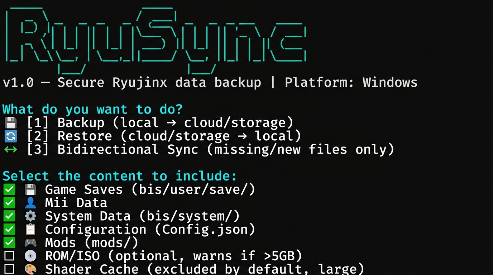

# RyuSync

[](README.md)
[](https://github.com/LeoRoy61/RyuSync)
[](https://github.com/LeoRoy61/RyuSync)
[](https://python.org)
[](LICENSE)
[](https://github.com/LeoRoy61/RyuSync/actions)

> **Backup e sincronizzazione sicura dei dati Ryujinx tra più PC Windows**

RyuSync è uno strumento CLI per **backup sicuro e additivo** delle configurazioni e dei salvataggi di [Ryujinx](https://ryujinx.org/) (emulatore Nintendo Switch) verso cloud (Google Drive, OneDrive, Mega) o storage locale/di rete. Funziona con **Windows Task Scheduler** — nessun daemon persistente, nessuna icona nel tray: si avvia, fa il suo lavoro, e termina.



---

## ✨ Caratteristiche principali

- 🛡️ **Mai cancellare nulla** — solo aggiunta, mai sovrascrittura automatica
- ⚡ **Rilevamento automatico** di Ryujinx (portable + AppData)
- ☁️ **Cloud via rclone** (Google Drive, OneDrive, Mega) + storage locale e SMB
- 🔄 **Sync bidirezionale additivo** — solo file mancanti o più nuovi
- ⚠️ **Gestione conflitti** — entrambe le versioni salvate con `_CONFLICT_PC1/_CONFLICT_PC2`
- 📋 **Log timestampato** per ogni operazione
- 🔔 **Notifiche desktop** Windows (opzionali)
- 🗜️ **Compressione .zip** opzionale pre-upload
- ♻️ **Retention configurabile** (mantieni le ultime N versioni)
- ✅ **Verifica integrità** SHA-256 o mtime+size
- 🏃 **Modalità dry-run** — vedi cosa farebbe senza eseguire
- 📅 **Task Scheduler** — cadenze da minuti a mesi, inclusa la chiusura di Ryujinx

---

## 📋 Requisiti

| Requisito | Versione |
|-----------|----------|
| Python | 3.10 o superiore |
| Windows | 10/11 (64-bit) |
| [rclone](https://rclone.org/downloads/) | Ultima versione stabile |

---

## 🚀 Installazione

### 1. Clona il repository

```bash
git clone https://github.com/LeoRoy61/RyuSync.git
cd ryusync
```

### 2. Installa le dipendenze Python

```bash
pip install -r requirements.txt
```

### 3. Installa rclone

Scarica rclone dal sito ufficiale: **https://rclone.org/downloads/**

Estrai `rclone.exe` e aggiungilo al PATH di Windows, oppure copialo nella cartella di RyuSync.

Verifica l'installazione:
```bash
rclone version
```

---

## ⚙️ Configurazione rclone (passo-passo)

### Google Drive

```bash
rclone config
```

Segui questi passi nel menu interattivo:

1. Scegli `n` → **New remote**
2. Nome: `gdrive` (o quello che preferisci)
3. Storage: digita `drive` e premi Invio
4. Client ID e Secret: lascia vuoti (premi Invio)
5. Scope: `1` (accesso completo) — *vedi nota permessi minimi sotto*
6. Service account: lascia vuoto
7. Use auto config: `y` → si aprirà il browser per l'autenticazione Google
8. Team Drive: `n`
9. Conferma con `y`

Verifica:
```bash
rclone listremotes
# Output atteso: gdrive:
```

> **💡 Nota sulla Configurazione Avanzata (Root folder ID / Permessi Minimi)**:
> Se desideri limitare rclone a una cartella dedicata (consigliato per concedere solo i permessi minimi, es. `RyuSync/`):
> 1. Quando viene richiesto `Edit advanced config?`, seleziona `y`.
> 2. Cerca la voce `Root folder ID` e incolla l'ID della tua cartella di backup (visibile nell'URL di Google Drive).
> 3. Per tutte le altre opzioni della configurazione avanzata, premi Invio per accettare i valori predefiniti.
> In questo modo, rclone potrà accedere SOLO a quella specifica cartella.

### OneDrive

```bash
rclone config
# Storage: onedrive
# Segui le istruzioni OAuth nel browser
```

### Mega

```bash
rclone config
# Storage: mega
# Inserisci email e password Mega
```

### Verifica rapida

```bash
rclone lsd gdrive:
# Mostra le cartelle sul tuo Google Drive
```

---

## 🎮 Utilizzo

### Modalità interattiva (prima esecuzione)

```bash
python ryusync.py
```

Il menu ti guiderà attraverso:
1. **Azione**: Backup / Ripristino / Sync bidirezionale
2. **Contenuti**: salvataggi, Mii, sistema, config, mod, ROM (opzionale), shader cache (esclusa default)
3. **Destinazione**: Google Drive, OneDrive, Mega, SSD locale, SMB
4. **Pianificazione**: dopo il primo backup riuscito, puoi schedulare i backup automatici

### Modalità dry-run (mostra senza eseguire)

```bash
python ryusync.py --dry-run
```

### Backup automatico (Task Scheduler)

Configurato automaticamente al termine del primo backup interattivo.
Puoi anche avviarlo manualmente:

```bash
python ryusync.py --mode=incremental --silent
```

### Rimuovi pianificazione

```bash
python ryusync.py --unschedule
```

### Aiuto

```bash
python ryusync.py --help
```

---

## 📅 Pianificazione automatica — Cadenze disponibili

Dopo il primo backup riuscito, RyuSync ti chiede se vuoi pianificare backup automatici.
Scegli la cadenza più adatta alle tue esigenze:

| # | Cadenza | Implementazione Windows |
|---|---------|------------------------|
| 1 | Ogni ora | `schtasks /sc HOURLY /mo 1` |
| 2 | Ogni 6 ore | `schtasks /sc HOURLY /mo 6` |
| 3 | Una volta al giorno | `schtasks /sc DAILY /mo 1 /st 03:00` |
| 4 | Ogni 3 giorni | `schtasks /sc DAILY /mo 3 /st 03:00` |
| 5 | Una volta a settimana | `schtasks /sc WEEKLY /mo 1 /st 03:00` |
| 6 | Una volta al mese | `schtasks /sc MONTHLY /mo 1 /st 03:00` |
| 7 | All'avvio del PC | `schtasks /sc ONSTART` |
| 8 | Alla chiusura di Ryujinx | Task watcher ogni 5 min via psutil |
| 9 | Personalizzato | es. ogni 10 giorni → `/sc DAILY /mo 10` |
| 10 | Nessuna pianificazione | — |

**Esempio personalizzato**: "ogni 10 giorni" →
```
Valore: 10
Unità: giorni
→ schtasks /sc DAILY /mo 10 /st 03:00
```

> **Perché Task Scheduler e non un processo persistente?**
> Un task pianificato di Windows si avvia, fa il suo lavoro e **termina completamente**.
> Non consuma RAM in background, non interferisce con Ryujinx durante il gioco,
> e sopravvive ai riavvii senza configurazione aggiuntiva.
> È l'approccio più robusto e meno invasivo per backup automatici su Windows.

---

## 🏗️ Struttura del progetto

```
RyuSync/
├── ryusync.py          # Entry point principale
├── detector.py         # Rilevamento automatico Ryujinx
├── backup_engine.py    # Logica backup/sync/conflitti/integrità
├── scheduler.py        # Integrazione Windows Task Scheduler
├── config.yaml         # Configurazione persistente (auto-generata)
├── requirements.txt    # Dipendenze Python
├── .gitignore
├── LICENSE             # MIT
├── README.md           # Questa guida (Italiano)
├── README.en.md        # Guida in inglese
├── logs/               # Log operazioni (auto-generati)
├── tests/
│   ├── conftest.py     # Fixtures pytest
│   ├── test_detector.py
│   └── test_backup_engine.py
└── .github/
    └── workflows/
        └── tests.yml   # CI su Windows (Python 3.10-3.13)
```

---

## 🛡️ Principio di sicurezza

RyuSync è progettato con un principio fondamentale:

> **Non cancella mai nulla. Non sovrascrive mai automaticamente.**

| Scenario | Comportamento |
|----------|--------------|
| File mancante a destinazione | ✅ Copia |
| File identico a destinazione | ⏭️ Salta |
| File locale più recente | ✅ Copia |
| File remoto più recente | ⚠️ Avvisa, chiede conferma |
| File con contenuto diverso (conflitto) | 💾 Salva entrambe le versioni con `_CONFLICT_` |
| File presente solo a destinazione | 🔒 Non tocca mai |

## 🔒 Sicurezza delle credenziali rclone

> ⚠️ **Punto critico spesso sottovalutato**: `rclone.conf` memorizza token OAuth e chiavi API
> in chiaro o con offuscamento minimo. Chiunque acceda a questo file può usare i tuoi account cloud.

### Controlla se rclone.conf è cifrato

RyuSync avvisa automaticamente all'avvio se il tuo `rclone.conf` non è cifrato.
Puoi anche controllare manualmente:

```bash
# Dove si trova il tuo rclone.conf:
rclone config file

# Se il file inizia con sezioni come [gdrive], [onedrive]...
# → NON è cifrato. Segui la guida sotto.

# Se inizia con "# Encrypted rclone configuration File"
# → Ottimo! Sei al sicuro.
```

### Imposta la cifratura AES-256 su rclone.conf

```bash
rclone config
# Nel menu principale scegli: s) Set configuration password
# Inserisci una password sicura e confermala
# Il file verrà cifrato con AES-256 (GCM)
```

Dopo aver impostato la password, rclone la chiederà ad ogni esecuzione.
Per l'uso con Task Scheduler (senza prompt interattivo), impostala come variabile d'ambiente:

```powershell
# In PowerShell (sessione corrente)
$env:RCLONE_CONFIG_PASS = "la-tua-password"

# In modo persistente (solo per l'utente corrente)
[System.Environment]::SetEnvironmentVariable("RCLONE_CONFIG_PASS", "la-tua-password", "User")
```

### Permessi OAuth minimi consigliati

Anziché concedere accesso all'intero Google Drive:

1. Crea una cartella dedicata su Google Drive (es. `RyuSync_Backup`)
2. Copia il suo **ID cartella** dall'URL: `drive.google.com/drive/folders/`**`1ABC...XYZ`**
3. Durante `rclone config`, scegli `y` per modificare la configurazione avanzata e, al passo "Root folder ID", incolla questo ID
4. rclone potrà accedere **solo** a quella cartella

### Protezione file di configurazione locale

RyuSync applica automaticamente permessi ristretti a `config.yaml` tramite `icacls`.
Verifica che i tuoi file siano protetti:

```powershell
# Controlla i permessi di config.yaml
icacls config.yaml

# Controlla i permessi di rclone.conf
icacls "%APPDATA%\rclone\rclone.conf"
```

---


Dopo la prima esecuzione interattiva, `config.yaml` viene creato automaticamente
con permessi ristretti (solo l'utente corrente può leggerlo).

Parametri principali:

```yaml
ryujinx_path: "C:\\Users\\Nome\\AppData\\Roaming\\Ryujinx"
pc_name: "PC-Gaming"
destination_type: "gdrive"
destination_path: "gdrive:RyuSync"

contents:
  saves: true
  mii: true
  system: true
  config: true
  mods: true
  roms: false           # Opzionale, avvisa se >5GB
  shader_cache: false   # Esclusa default (rigenerabile)

integrity_method: "mtime_size"   # o "sha256"
compress_before_upload: false
keep_versions: 3
size_warning_threshold_gb: 5.0
desktop_notifications: true
```

---

## 🧪 Esecuzione dei test

```bash
python -m pytest tests/ -v
```

Output atteso: **71 test PASSED** ✅

---

## 📊 Struttura dati Ryujinx gestita

| Percorso | Contenuto | Default |
|----------|-----------|---------|
| `bis/user/save/` | Salvataggi per ID titolo | ✅ incluso |
| `bis/user/save/*/mii/` | Dati Mii | ✅ incluso |
| `bis/system/` | Dati di sistema e account | ✅ incluso |
| `Config.json` | Impostazioni generali | ✅ incluso |
| `mods/` | Mod dei giochi | ✅ incluso |
| `games/` (o path da Config) | ROM/ISO | ❌ escluso (opzionale) |
| Shader cache | Cache shader | ❌ escluso (rigenerabile) |

---

## 🗺️ Roadmap

### v1.0 (attuale) — Solo Windows
- ✅ Backup additivo (mai cancellazione)
- ✅ Gestione conflitti multi-PC
- ✅ rclone cloud + storage locale/SMB
- ✅ Windows Task Scheduler
- ✅ Notifiche desktop Windows
- ✅ Test suite (71 test)

### v2.0 (futura) — Se il progetto avrà seguito

Il supporto a **Linux** e **macOS** è pianificato per una versione futura.
L'architettura del codice è già predisposta con funzioni `detect_ryujinx_path(os_name)`
e `create_scheduled_task(os_name, frequency)` che oggi gestiscono solo `"windows"`,
ma sono pronte per ricevere i branch `"linux"` e `"darwin"` senza modificare la logica core.

**Linux**: rilevamento in `~/.config/Ryujinx`, pianificazione via systemd timer o crontab.
**macOS**: rilevamento in `~/Library/Application Support/Ryujinx`, pianificazione via launchd.

> 💡 Vuoi contribuire al supporto Linux/macOS? Apri una issue o una PR su GitHub!

---

## 📝 Licenza

MIT — vedi [LICENSE](LICENSE)

---

## 🤝 Contribuire

Leggi la guida completa in [CONTRIBUTING.md](CONTRIBUTING.md).

1. Fork del repository
2. Crea un branch: `git checkout -b feature/nome-feature`
3. Aggiungi test per le nuove funzionalità
4. Apri una Pull Request

I test devono passare su Windows con Python 3.10+ prima del merge.

---

## 📅 Changelog

Vedi [CHANGELOG.md](CHANGELOG.md) per la storia completa delle versioni.
